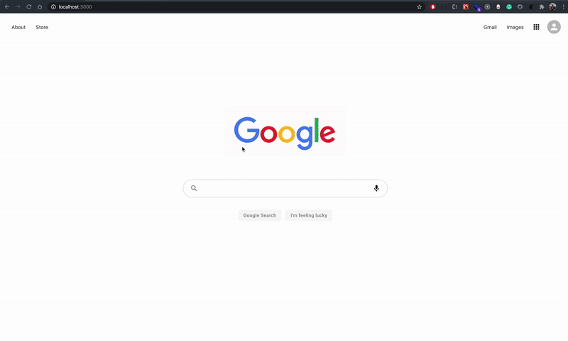

## Project Overview

A react-based <code>Google Search engine clone</code> application to search through the web using google's <code>Custom Search JSON API</code> and <code>Programmable Search Engine</code> by Google

## Demo

## Project Setup

<ul>

### Clone the project 

<code>git clone https://github.com/dineshnadimpalli/React-Google-Search-Clone.git</code>
  

### Install Dependencies

Enter the project directory and do

<code>npm install (or) npm i</code>
  

### Run the application

<code>npm start</code>

This will run the project in http://localhost:3000
  

### Create a Firebase project

To use the custom search API you need to create a firebase project using firebase console <a>https://console.firebase.google.com</a> and copy the <code>Web API key</code> from your Project settings and paste it in the <code>keys.js</code> file
  

### Create a custom Search Engine

- Use the following link <a>https://developers.google.com/custom-search/docs/tutorial/creatingcse</a> to create a search engine according to your requirements. 
  

- For this project, I have set the <code>Sites to search</code> field as <a>www.google.com</a> and after the project is setup, go to <code>Setup > Search the entire web</code> and set it to <b>ON</b>
  

- Don't forget to copy the <code>Search engine ID</code> and paste it in <code>keys.js</code> file
  

### One Last Step

Modify the <code>index.js</code> file in <code>src > Pages > SearchPage</code> according to the comments mentioned to fetch the actual search results instead of pre-loaded data

</ul>

  

## Boom! 🚀 you should be good to go now

## Happy Coding... 👨🏻‍💻✌️

   

## Resource Links

- https://developers.google.com/custom-search/v1/using_rest
- https://developers.google.com/custom-search/docs/tutorial/creatingcse

